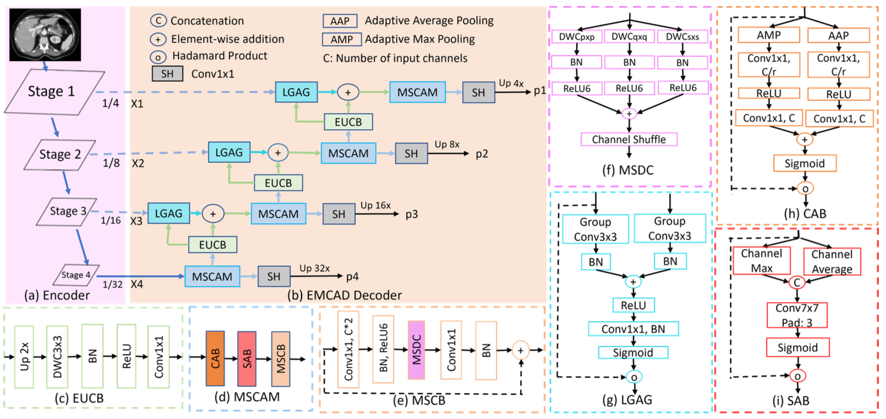
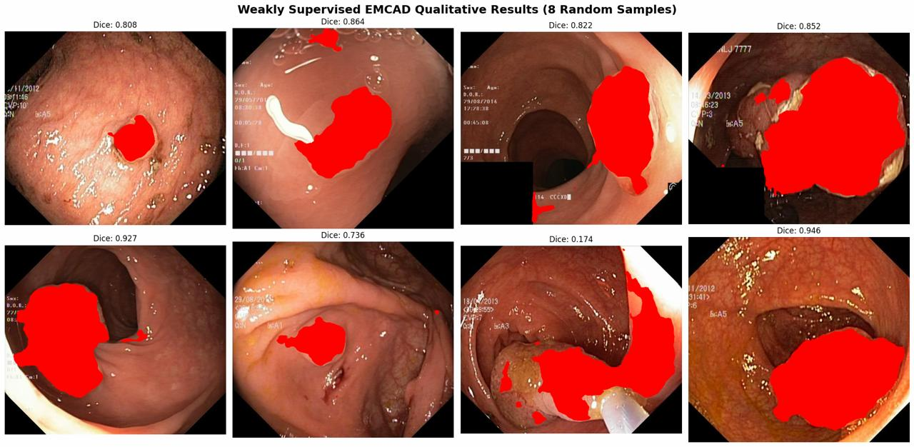
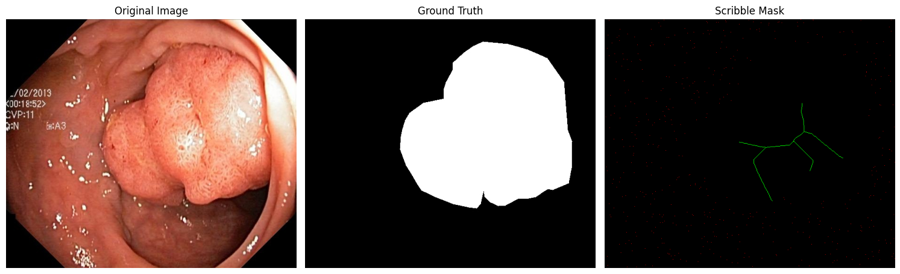

# Weakly Supervised EMCAD for Polyp Segmentation

This repository contains the current EMCAD-based polyp segmentation pipeline used in this workspace. The main entry points are:

- `train_polyp.py` for weak/scribble supervision
- `train_polyp_FS.py` for a full-supervision baseline
- `test_polyp.py` for evaluation and export of metrics

## Architecture

<p align="center">
  
</p>

## Qualitative Results

<p align="center">
  
</p>

## Scribble Masking

<p align="center">
  
</p>

## Current project summary

The updated code currently includes:

- weak-supervision training in `train_polyp.py` with multi-scale loss terms and checkpoint logging;
- a full-supervision baseline in `train_polyp_FS.py` for comparison;
- evaluation in `test_polyp.py` that writes per-image metrics and spreadsheet summaries;
- corrected loader imports in `utils/dataloader.py` and `utils/dataloader_polyp.py` so the runtime resolves the weak-mask utility path properly.

Validation completed in this environment:

- `python train_polyp.py --help` starts successfully.
- `python test_polyp.py --help` starts successfully.
- `python -m compileall train_polyp.py train_polyp_FS.py test_polyp.py utils lib` passes.

## Environment setup

```bash
conda create -n emcadenv python=3.9
conda activate emcadenv
python -m pip install --upgrade pip
python -m pip install torch torchvision --index-url https://download.pytorch.org/whl/cpu
python -m pip install -r requirements.txt
```

If dependency resolution is problematic on your machine, install the runtime packages used by the current scripts directly:

```bash
python -m pip install timm==0.6.12 opencv-python-headless albumentations medpy seaborn ptflops thop tensorboardx ml-collections loguru torchsummary torchsummaryx segmentation-mask-overlay
```

## Data layout

Place the polyp datasets in the following structure before training:

```text
./data/polyp/target/ClinicDB/train/images/
./data/polyp/target/ClinicDB/train/masks/
./data/polyp/target/ClinicDB/test/images/
./data/polyp/target/ClinicDB/test/masks/
```

## Pretrained encoder weights

Put the PVTv2 checkpoint files in `./pretrained_pth/pvt/` before running an encoder-based training job.

## Training

### Weakly supervised run

```bash
python train_polyp.py \
  --encoder pvt_v2_b2 \
  --pretrained_dir ./pretrained_pth/pvt/ \
  --train_path ./data/polyp/target/ClinicDB/train/ \
  --test_path ./data/polyp/target/ClinicDB/ \
  --epoch 200 \
  --batchsize 8
```

### Full-supervision baseline

```bash
python train_polyp_FS.py \
  --train_path ./data/polyp/target/ClinicDB/train/ \
  --test_path ./data/polyp/target/ClinicDB/ \
  --epoch 200 \
  --batchsize 8
```

## Evaluation

```bash
python test_polyp.py \
  --run_id <run_id> \
  --encoder pvt_v2_b2 \
  --dataset_name ClinicDB
```

The evaluation script writes prediction masks to `./predictions_polyp/<run_id>/` and stores spreadsheet summaries in `./results_polyp/` and `./All_Runs_Summary_Polyp.xlsx`.

## Acknowledgements

We are grateful to the authors and maintainers of [EMCAD](https://github.com/SLDGroup/EMCAD), [timm](https://github.com/huggingface/pytorch-image-models), [CASCADE](https://github.com/SLDGroup/CASCADE), [MERIT](https://github.com/SLDGroup/MERIT), [G-CASCADE](https://github.com/SLDGroup/G-CASCADE), [PP-SAM](https://github.com/SLDGroup/PP-SAM), [PraNet](https://github.com/DengPingFan/PraNet), [Polyp-PVT](https://github.com/DengPingFan/Polyp-PVT), and [TransUNet](https://github.com/Beckschen/TransUNet).

## Citation

```bibtex
@inproceedings{rahman2024emcad,
  title={EMCAD: Efficient Multi-Scale Convolutional Attention Decoding for Medical Image Segmentation},
  author={Rahman, Md Mostafijur and Munir, Mustafa and Marculescu, Radu},
  booktitle={Proceedings of the IEEE/CVF Conference on Computer Vision and Pattern Recognition},
  pages={11769--11779},
  year={2024}
}
```
